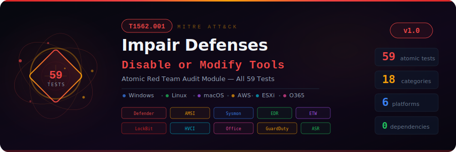

<p align="center">
  
</p>

<p align="center">
  <strong>Offline audit tool that checks your hosts for indicators of all 59 Atomic Red Team tests<br/>
  mapped to MITRE ATT&CK T1562.001 — Impair Defenses: Disable or Modify Tools</strong>
</p>

<p align="center">
  
  
  
  
  
  
  
</p>

---

## What This Tool Does

Adversaries routinely disable or tamper with security tools before launching attacks — turning off Windows Defender, bypassing AMSI, unloading Sysmon, killing EDR services, or disabling event logging. This technique, [MITRE ATT&CK T1562.001](https://attack.mitre.org/techniques/T1562/001/), is one of the most commonly observed in real-world incidents from ransomware groups like **LockBit**, **BlackCat**, and **Conti**, as well as nation-state actors.

The [Atomic Red Team](https://github.com/redcanaryco/atomic-red-team) project documents **59 individual tests** for this technique — each representing a specific way that attackers disable defenses.

**This tool audits your host configuration exports against all 59 tests**, checking for indicators that any of these defensive impairments have occurred or are currently active on your systems.

### How It Works

```
┌─────────────────────────────────────────────────────────────────┐
│              Host Configuration Exports (JSON)                   │
│  Registry · Services · Defender · Sysmon · ETW · Processes       │
│  Linux services · macOS launchd · sysctl · AWS GuardDuty         │
└───────────────────────────┬─────────────────────────────────────┘
                            │
                 ┌──────────▼──────────┐
                 │   T1562.001 Auditor  │
                 │   59 check methods   │
                 │   18 categories      │
                 └──────────┬──────────┘
                            │
        ┌───────────────────┼───────────────────┐
        │                   │                    │
  ┌─────▼─────┐   ┌────────▼────────┐   ┌──────▼──────┐
  │  Windows   │   │  Linux/macOS    │   │   Cloud     │
  │  28 tests  │   │  15 tests       │   │   3 tests   │
  │  Defender  │   │  syslog, EDR,   │   │  GuardDuty  │
  │  AMSI, ETW │   │  SELinux, ASLR  │   │  ESXi, O365 │
  │  Sysmon    │   │  Gatekeeper     │   │             │
  └─────┬─────┘   └────────┬────────┘   └──────┬──────┘
        │                   │                    │
        └───────────────────┼───────────────────┘
                            │
                 ┌──────────▼──────────┐
                 │   JSON Report        │
                 │   with severity,     │
                 │   remediation, GUIDs │
                 └─────────────────────┘
```

---

## Quick Start

### 1. Clone the Repository

```bash
git clone https://github.com/Krishcalin/CrowdStrike-Red-Teaming-Test.git
cd CrowdStrike-Red-Teaming-Test
```

### 2. Run Against Sample Data

The repository includes sample data with deliberate misconfigurations for testing:

```bash
python t1562_001_audit.py --data-dir ./sample_data --output report.json
```

### 3. Run Against Your Own Host

Export your host configuration (see [Exporting Host Configurations](#exporting-host-configurations) below), then:

```bash
python t1562_001_audit.py --data-dir ./my_exports --output my_report.json

# Filter to CRITICAL and HIGH only
python t1562_001_audit.py --data-dir ./my_exports --severity HIGH
```

### 4. Review Findings

Open the JSON report. Each finding includes:

```json
{
  "test_number": 16,
  "check_id": "T1562.001-16",
  "title": "Defender ATP tampered via PowerShell (4 settings)",
  "severity": "CRITICAL",
  "category": "Windows Defender Tampering",
  "description": "Set-MpPreference used to disable Defender protections.",
  "affected_items": ["DisableRealtimeMonitoring = True", "..."],
  "remediation": "Set-MpPreference -DisableRealtimeMonitoring 0",
  "platform": "Windows",
  "atomic_guid": "6b8df440-51ec-4d53-bf83-899591c9b5d7",
  "technique": "T1562.001"
}
```

---

## Complete Test Catalog (All 59)

### Category A — Syslog & Linux Security (10 tests)

| # | Atomic Test | Platform | Severity | What It Checks |
|---|-------------|----------|----------|----------------|
| 1 | Disable syslog | Linux | HIGH | rsyslog service stopped/disabled |
| 2 | Disable syslog (FreeBSD) | Linux | HIGH | syslogd service stopped |
| 4 | Disable SELinux | Linux | HIGH | SELinux in permissive/disabled mode |
| 5 | Stop CrowdStrike Falcon on Linux | Linux | CRITICAL | falcon-sensor.service stopped |
| 39 | Clear history | Linux | MEDIUM | bash history cleared (history -c) |
| 40 | Suspend history | Linux | MEDIUM | set +o history detected |
| 41 | Reboot via kernel SysRq | Linux | MEDIUM | kernel.sysrq=1 |
| 42 | Clear paging cache | Linux | LOW | vm.drop_caches=3 |
| 43 | Disable memory swap | Linux | MEDIUM | swapoff -a detected |
| 59 | Disable ASLR via sysctl | Linux | HIGH | kernel.randomize_va_space=0 |

### Category B — macOS Security Tools (5 tests)

| # | Atomic Test | Platform | Severity | What It Checks |
|---|-------------|----------|----------|----------------|
| 6 | Disable Carbon Black (macOS) | macOS | HIGH | CB daemon unloaded |
| 7 | Disable LittleSnitch | macOS | HIGH | LittleSnitch daemon unloaded |
| 8 | Disable OpenDNS Umbrella | macOS | HIGH | OpenDNS daemon unloaded |
| 9 | Disable macOS Gatekeeper | macOS | HIGH | spctl --master-disable |
| 10 | Stop CrowdStrike Falcon (macOS) | macOS | HIGH | falcond daemon unloaded |

### Category C — Sysmon Tampering (2 tests)

| # | Atomic Test | Platform | Severity | What It Checks |
|---|-------------|----------|----------|----------------|
| 11 | Unload Sysmon filter driver | Windows | HIGH | SysmonDrv not in fltmc output |
| 12 | Uninstall Sysmon | Windows | HIGH | Sysmon service not in services list |

### Category D — AMSI Bypass (4 tests)

| # | Atomic Test | Platform | Severity | What It Checks |
|---|-------------|----------|----------|----------------|
| 13 | AMSI Bypass - InitFailed | Windows | CRITICAL | amsiInitFailed set to True |
| 14 | AMSI Bypass - Remove Provider Key | Windows | CRITICAL | AMSI provider registry key deleted |
| 45 | AMSI Bypass - Override COM | Windows | CRITICAL | IAmsi COM interface overridden |
| 53 | AMSI Bypass - AmsiEnable RegKey | Windows | HIGH | AmsiEnable=0 in registry |

### Category E — Security Services (3 tests)

| # | Atomic Test | Platform | Severity | What It Checks |
|---|-------------|----------|----------|----------------|
| 3 | Disable CB Response | Linux | HIGH | cbdaemon stopped |
| 15 | Disable arbitrary security service | Windows | CRITICAL | 14 known EDR/AV services checked |
| 21 | Stop and remove security service | Windows | HIGH | Software installed but service missing |

### Category F — Windows Defender Tampering (13 tests)

| # | Atomic Test | Platform | Severity | What It Checks |
|---|-------------|----------|----------|----------------|
| 16 | Tamper Defender via PowerShell | Windows | CRITICAL | DisableRealtimeMonitoring, DisableBehaviorMonitoring, DisableScriptScanning, DisableBlockAtFirstSeen |
| 17 | Tamper Defender via CMD | Windows | CRITICAL | WinDefend service stopped |
| 18 | Tamper Defender registry | Windows | CRITICAL | DisableAntiSpyware=1 |
| 20 | Remove Defender definitions | Windows | HIGH | Signature age >14 days |
| 23 | Defender exclude folder | Windows | HIGH | Exclusions on C:\Temp, C:\Windows\Temp, etc. |
| 24 | Defender exclude extension | Windows | CRITICAL | .exe, .ps1, .dll, etc. excluded |
| 25 | Defender exclude process | Windows | CRITICAL | powershell.exe, cmd.exe, etc. excluded |
| 27 | Disable Defender via DISM | Windows | CRITICAL | Windows-Defender feature disabled |
| 28 | Disable Defender via AdvancedRun | Windows | HIGH | AdvancedRun.exe process detected (WhisperGate) |
| 31 | Tamper Defender via aliases | Windows | HIGH | Set-MpPreference aliases (drtm, dbm, etc.) |
| 36 | Disable Defender via PwSh cmdlet | Windows | CRITICAL | Disable-WindowsOptionalFeature |
| 37 | WMIC Defender exclusion | Windows | HIGH | WMI-based exclusion path |
| 38 | Delete Defender scheduled tasks | Windows | HIGH | 4 Defender tasks missing |

### Category G — Defender Registry (2 tests)

| # | Atomic Test | Platform | Severity | What It Checks |
|---|-------------|----------|----------|----------------|
| 48 | Defender registry via reg.exe | Windows | CRITICAL | GPO registry keys set to disable |
| 49 | Defender registry via PowerShell | Windows | CRITICAL | Same keys set via New-ItemProperty |

### Category H — Office Security (1 test)

| # | Atomic Test | Platform | Severity | What It Checks |
|---|-------------|----------|----------|----------------|
| 19 | Disable Office security features | Windows | HIGH | VBA macros enabled, Protected View disabled |

### Category I — O365 AntiPhish (1 test)

| # | Atomic Test | Platform | Severity | What It Checks |
|---|-------------|----------|----------|----------------|
| 26 | Disable AntiPhishRule | O365 | HIGH | Requires O365 config export |

### Category J — EDR-Specific (4 tests)

| # | Atomic Test | Platform | Severity | What It Checks |
|---|-------------|----------|----------|----------------|
| 22 | Uninstall CrowdStrike (Windows) | Windows | CRITICAL | CrowdStrike service missing |
| 29 | Kill AV with Backstab | Windows | CRITICAL | Backstab.exe process detected |
| 30 | WinPwn kill event log | Windows | CRITICAL | EventLog service stopped |
| 58 | Freeze PPL with EDR-Freeze | Windows | CRITICAL | EDR-Freeze process detected |

### Category L — LockBit Black (4 tests)

| # | Atomic Test | Platform | Severity | What It Checks |
|---|-------------|----------|----------|----------------|
| 32 | LockBit: Disable Privacy (cmd) | Windows | MEDIUM | DisablePrivacyExperience=1 |
| 33 | LockBit: Auto logon (cmd) | Windows | HIGH | AutoAdminLogon=1 |
| 34 | LockBit: Disable Privacy (PS) | Windows | MEDIUM | Same as 32 via PowerShell |
| 35 | LockBit: Auto logon (PS) | Windows | HIGH | Same as 33 via PowerShell |

### Category M — HVCI (1 test)

| # | Atomic Test | Platform | Severity | What It Checks |
|---|-------------|----------|----------|----------------|
| 44 | Disable HVCI | Windows | HIGH | HypervisorEnforcedCodeIntegrity=0 (BlackLotus TTP) |

### Category N — Cloud & Infrastructure (3 tests)

| # | Atomic Test | Platform | Severity | What It Checks |
|---|-------------|----------|----------|----------------|
| 46 | AWS GuardDuty suspension | AWS | CRITICAL | GuardDuty suspended or deleted |
| 47 | Defender ATP on Linux/macOS | Linux | HIGH | mdatp service stopped |
| 50 | ESXi disable lockout | ESXi | HIGH | AccountLockFailures=0 |

### Category Q — Defender ASR Rules (2 tests)

| # | Atomic Test | Platform | Severity | What It Checks |
|---|-------------|----------|----------|----------------|
| 51 | Delete ASR rules (InTune) | Windows | HIGH | No ASR rules configured |
| 52 | Delete ASR rules (GPO) | Windows | HIGH | Same check via GPO |

### Category R — ETW Tampering (4 tests)

| # | Atomic Test | Platform | Severity | What It Checks |
|---|-------------|----------|----------|----------------|
| 54 | Disable ETW Auto Logger (cmd) | Windows | CRITICAL | EventLog-Application Start=0 |
| 55 | Disable ETW Auto Logger (PS) | Windows | CRITICAL | Same via PowerShell |
| 56 | Disable ETW Provider (cmd) | Windows | HIGH | Specific ETW provider Enabled=0 |
| 57 | Disable ETW Provider (PS) | Windows | HIGH | Same via PowerShell |

---

## Exporting Host Configurations

The tool reads JSON files from a directory. Below are the commands to generate each file on the target platform.

### Windows (PowerShell — Run as Administrator)

```powershell
$out = ".\host_exports"
New-Item -ItemType Directory $out -Force | Out-Null

# Services
Get-Service | Select-Object Name, Status, StartType |
  ConvertTo-Json | Out-File "$out\services.json"

# Windows Defender preferences
Get-MpPreference | ConvertTo-Json -Depth 3 | Out-File "$out\defender_preferences.json"

# Windows Defender status
Get-MpComputerStatus | ConvertTo-Json | Out-File "$out\defender_status.json"

# Defender exclusions (already in preferences, but also standalone)
$prefs = Get-MpPreference
@{ExclusionPath=$prefs.ExclusionPath;
  ExclusionExtension=$prefs.ExclusionExtension;
  ExclusionProcess=$prefs.ExclusionProcess} |
  ConvertTo-Json | Out-File "$out\defender_exclusions.json"

# Registry keys (Defender, AMSI, HVCI, LockBit, ETW, Office)
$keys = @{}
$paths = @(
  "HKLM:\SOFTWARE\Policies\Microsoft\Windows Defender",
  "HKLM:\SOFTWARE\Microsoft\AMSI\Providers",
  "HKCU:\Software\Microsoft\Windows Script\Settings",
  "HKLM:\SYSTEM\CurrentControlSet\Control\DeviceGuard\Scenarios\HypervisorEnforcedCodeIntegrity",
  "HKCU:\Software\Policies\Microsoft\Windows\OOBE",
  "HKLM:\Software\Policies\Microsoft\Windows NT\CurrentVersion\Winlogon",
  "HKLM:\System\CurrentControlSet\Control\WMI\Autologger\EventLog-Application",
  "HKCU:\Software\Microsoft\Office\16.0\Excel\Security"
)
foreach ($p in $paths) {
  try { Get-ItemProperty $p -EA Stop | ForEach-Object {
    $_.PSObject.Properties | Where-Object { $_.Name -notlike "PS*" } |
      ForEach-Object { $keys["$p\$($_.Name)"] = $_.Value }
  }} catch {}
}
# Check AMSI provider key existence
$amsiKey = "HKLM:\SOFTWARE\Microsoft\AMSI\Providers\{2781761E-28E0-4109-99FE-B9D127C57AFE}"
if (-not (Test-Path $amsiKey)) {
  $keys[$amsiKey.Replace("HKLM:","HKLM")] = "MISSING"
}
$keys | ConvertTo-Json | Out-File "$out\registry.json"

# Running processes
Get-Process | Select-Object Name, Id, Path |
  ConvertTo-Json | Out-File "$out\processes.json"

# Filter drivers (Sysmon check)
$drivers = fltmc filters 2>$null | ForEach-Object {
  if ($_ -match '^\S+') { @{name=$matches[0]} }
} | Where-Object { $_ }
@{drivers=$drivers} | ConvertTo-Json | Out-File "$out\filter_drivers.json"

# Scheduled tasks (Defender tasks)
Get-ScheduledTask -TaskPath "\Microsoft\Windows\Windows Defender\*" -EA SilentlyContinue |
  Select-Object TaskName, State | ConvertTo-Json | Out-File "$out\scheduled_tasks.json"

# Installed software
Get-CimInstance Win32_Product -EA SilentlyContinue |
  Select-Object Name, Version | ConvertTo-Json | Out-File "$out\installed_software.json"

# ASR Rules
try {
  $asr = Get-MpPreference
  @{AttackSurfaceReductionRules_Ids=$asr.AttackSurfaceReductionRules_Ids;
    AttackSurfaceReductionRules_Actions=$asr.AttackSurfaceReductionRules_Actions} |
    ConvertTo-Json | Out-File "$out\asr_rules.json"
} catch {}

# ETW Auto Logger
$etw = @{}
$autoPath = "HKLM:\System\CurrentControlSet\Control\WMI\Autologger\EventLog-Application"
try { Get-ItemProperty $autoPath -EA Stop | ForEach-Object {
  $_.PSObject.Properties | Where-Object { $_.Name -notlike "PS*" } |
    ForEach-Object { $etw["$autoPath\$($_.Name)"] = $_.Value }
}} catch {}
$etw | ConvertTo-Json | Out-File "$out\etw_autologger.json"

Write-Host "Exported to $out — $(Get-ChildItem $out | Measure-Object).Count files"
```

### Linux (Bash — Run as root)

```bash
OUT="./host_exports" && mkdir -p "$OUT"

# Services
systemctl list-units --type=service --all --no-pager --output=json \
  > "$OUT/linux_services.json" 2>/dev/null || \
  systemctl list-units --type=service --all --no-pager | \
  awk 'NR>1 && NF>2 {print "{\"name\":\""$1"\",\"status\":\""$3"\"}"}' | \
  jq -s '{services: .}' > "$OUT/linux_services.json"

# SELinux
echo "{\"selinux_mode\":\"$(getenforce 2>/dev/null || echo unknown)\"}" \
  > "$OUT/linux_security.json"

# sysctl parameters
sysctl kernel.sysrq kernel.randomize_va_space vm.drop_caches 2>/dev/null | \
  awk -F' = ' '{gsub(/\./,"_",$1); printf "\"%s\":\"%s\",",$1,$2}' | \
  sed 's/,$//' | sed 's/^/{/' | sed 's/$/}/' > "$OUT/sysctl.json"

# Shell history
echo "{\"lines\":$(wc -l < ~/.bash_history 2>/dev/null || echo 0)}" \
  > "$OUT/shell_history.json"

# Swap
echo "{\"swap_total_kb\":$(free | awk '/Swap/{print $2}')}" \
  > "$OUT/swap_config.json"

echo "Exported to $OUT"
```

### macOS (Bash — Run as root)

```bash
OUT="./host_exports" && mkdir -p "$OUT"

# LaunchDaemons
launchctl list | awk 'NR>1 {print "{\"label\":\""$3"\",\"status\":\"loaded\"}"}' | \
  jq -s '{daemons: .}' > "$OUT/macos_launchd.json"

# Gatekeeper
GK=$(spctl --status 2>&1)
echo "{\"gatekeeper\":\"$GK\"}" >> "$OUT/macos_launchd.json"
```

### AWS

```bash
# GuardDuty
aws guardduty list-detectors --output json > host_exports/aws_guardduty.json
```

---

## Data File Format Reference

The tool looks for the following JSON files in your `--data-dir`:

| File | Purpose | Key Fields |
|------|---------|------------|
| `services.json` | Windows services | `[{name, status, start_type}]` |
| `linux_services.json` | Linux systemd services | `{services: [{name, status}]}` |
| `macos_launchd.json` | macOS launch daemons | `{daemons: [{label, status}], gatekeeper}` |
| `defender_preferences.json` | Get-MpPreference output | `{DisableRealtimeMonitoring, ...}` |
| `defender_status.json` | Get-MpComputerStatus | `{AntivirusSignatureAge}` |
| `defender_exclusions.json` | Defender exclusion lists | `{ExclusionPath, ExclusionExtension, ExclusionProcess}` |
| `registry.json` | Registry key values | `{"HKLM\\path\\key": "value"}` |
| `processes.json` | Running processes | `{processes: [{name}]}` |
| `filter_drivers.json` | fltmc filters output | `{drivers: [{name}]}` |
| `amsi_providers.json` | AMSI state | `{amsiInitFailed, com_override}` |
| `scheduled_tasks.json` | Scheduled tasks | `{tasks: [{TaskName}]}` |
| `installed_software.json` | Installed programs | `{software: [{name}], features: [{name, state}]}` |
| `etw_autologger.json` | ETW Auto Logger config | `{"HKLM\\...\\Start": "0"}` |
| `device_guard.json` | HVCI / Device Guard | `{"...\\Enabled": "0"}` |
| `sysctl.json` | Linux kernel params | `{"kernel.sysrq": "1"}` |
| `shell_history.json` | Bash history state | `{history_cleared, lines}` |
| `swap_config.json` | Swap status | `{swap_disabled, swap_total_kb}` |
| `linux_security.json` | SELinux state | `{selinux_mode}` |
| `aws_guardduty.json` | GuardDuty state | `{suspended, deleted}` |
| `esx_config.json` | ESXi security config | `{Security.AccountLockFailures}` |
| `asr_rules.json` | Defender ASR rules | `{AttackSurfaceReductionRules_Ids}` |
| `office_registry.json` | Office registry keys | `{"...\\VBAWarnings": "1"}` |
| `lockbit_registry.json` | LockBit-specific keys | `{"...\\AutoAdminLogon": "1"}` |

---

## Project Structure

```
CrowdStrike-Red-Teaming-Test/
├── t1562_001_audit.py           # Main audit module (969 lines, 59 checks)
├── sample_data/                 # 19 demo config files with deliberate weaknesses
│   ├── services.json            # WinDefend stopped, EventLog stopped
│   ├── linux_services.json      # rsyslog inactive, falcon-sensor stopped
│   ├── defender_preferences.json # Realtime monitoring disabled, dangerous exclusions
│   ├── registry.json            # DisableAntiSpyware=1, AMSI key missing, HVCI=0
│   ├── processes.json           # AdvancedRun.exe running
│   ├── macos_launchd.json       # CrowdStrike unloaded, Gatekeeper disabled
│   ├── amsi_providers.json      # amsiInitFailed=True
│   ├── sysctl.json              # ASLR disabled, SysRq enabled
│   └── ...                      # 11 more config files
├── docs/
│   └── banner.svg               # Project banner
├── .gitignore
├── LICENSE
└── README.md
```

---

## Real-World Threat Mapping

These Atomic tests are based on real adversary behavior documented in the wild:

| Threat Actor / Malware | Tests Used | Campaign |
|------------------------|------------|----------|
| **LockBit Black** | #32-35 | Disable Privacy Experience, Auto logon for persistence |
| **WhisperGate** | #28 | NirSoft AdvancedRun to stop Defender as SYSTEM |
| **Conti** | #16-18 | Set-MpPreference to disable all Defender protections |
| **BlackBasta** | #15, #17 | Stop security services via sc.exe |
| **Gootloader** | #37 | WMIC to add Defender exclusion paths |
| **FIN7** | #58 | EDR-Freeze to suspend PPL-protected EDR processes |
| **BlackLotus** | #44 | Disable HVCI via registry (CVE-2022-21894) |
| **Kasseika Ransomware** | #29 | Backstab to kill antimalware protected processes |
| **Awfulshred Wiper** | #39-43 | Clear history, disable swap, clear page cache |
| **INC Ransomware** | #27 | DISM to remove Windows Defender feature |

---

## CLI Reference

```
usage: t1562_001_audit.py [-h] --data-dir DATA_DIR [--output OUTPUT]
                          [--severity {CRITICAL,HIGH,MEDIUM,LOW,ALL}]

T1562.001 Atomic Red Team Audit

arguments:
  --data-dir DATA_DIR   Directory containing host config JSON exports
  --output OUTPUT       Output report file (default: t1562_001_report.json)
  --severity SEVERITY   Filter findings by minimum severity (default: ALL)
```

**Examples:**

```bash
# Full audit with all findings
python t1562_001_audit.py --data-dir ./exports --output full_report.json

# Only CRITICAL findings
python t1562_001_audit.py --data-dir ./exports --severity CRITICAL

# Quick test with sample data
python t1562_001_audit.py --data-dir ./sample_data
```

---

## References

### MITRE ATT&CK
- [T1562.001 — Impair Defenses: Disable or Modify Tools](https://attack.mitre.org/techniques/T1562/001/)
- [MITRE ATT&CK — Defense Evasion](https://attack.mitre.org/tactics/TA0005/)

### Atomic Red Team
- [T1562.001 Atomic Tests (all 59)](https://atomicredteam.io/docs/atomics/T1562.001)
- [Atomic Red Team GitHub](https://github.com/redcanaryco/atomic-red-team)
- [T1562.001.yaml Source](https://github.com/redcanaryco/atomic-red-team/blob/master/atomics/T1562.001/T1562.001.yaml)

### Threat Intelligence
- [Red Canary — Threat Detection Report: Disable or Modify Tools](https://redcanary.com/threat-detection-report/techniques/disable-or-modify-tools/)
- [Picus Security — T1562.001 Analysis](https://www.picussecurity.com/resource/blog/t1562-001-disable-or-modify-tools)
- [DFIR Report — Gootloader (Defender Task Deletion)](https://thedfirreport.com/2022/05/09/seo-poisoning-a-gootloader-story/)
- [Microsoft — BlackLotus UEFI Bootkit Guidance](https://www.microsoft.com/en-us/security/blog/2023/04/11/guidance-for-investigating-attacks-using-cve-2022-21894-the-blacklotus-campaign/)
- [Sophos — EDR Kill Shifter](https://news.sophos.com/en-us/2024/08/14/edr-kill-shifter/)

---

## Disclaimer

This tool is for **authorized security assessments on systems you own or have permission to test**. It performs **offline analysis only** — it reads JSON files and does not execute any commands, modify any system, or connect to any network. All Atomic test references are from the open-source Atomic Red Team project maintained by Red Canary.

---

## License

MIT License — see [LICENSE](LICENSE).
